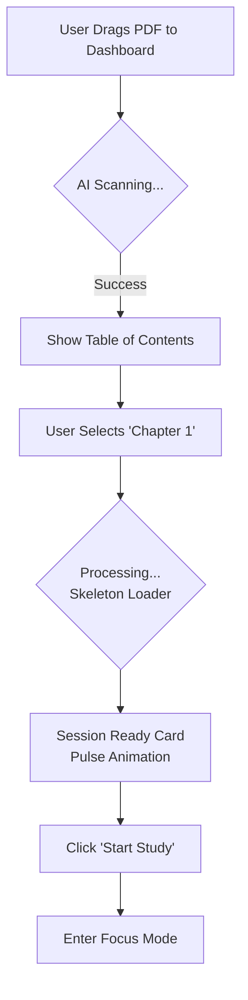
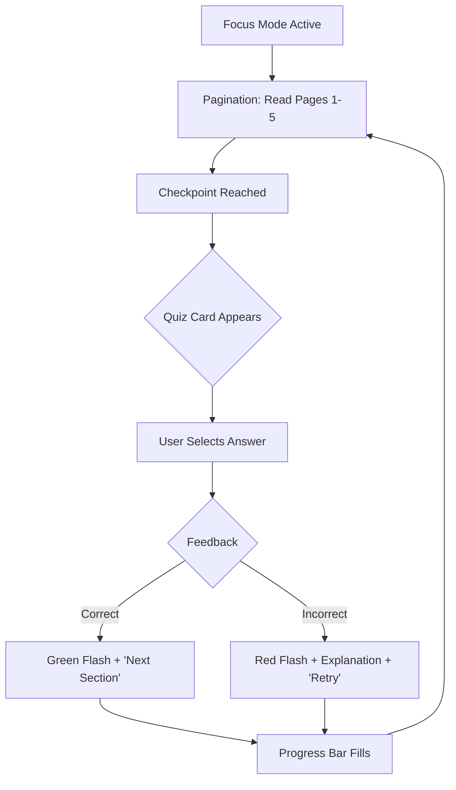
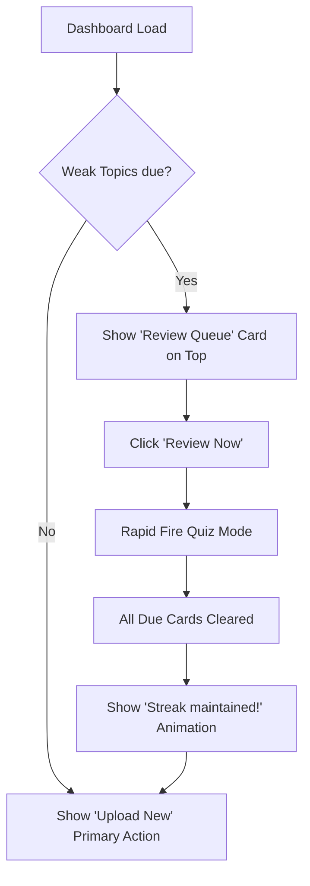

# UX Design Specification test

**Author:** Yorran
**Date:** 2026-01-31

---

<!-- UX design content will be appended sequentially through collaborative workflow steps -->

## Responsive Design & Accessibility

### Responsive Strategy
*   **Mobile First:** The P0 experience. 80% of use cases (Commute/waiting in line) happen here. Layout is vertically stacked.
*   **Tablet:** "Study + Context" layout. Squeezes more value from the screen by showing the Source PDF alongside the Quiz Card.
*   **Desktop:** High-Density Dashboard for management, but "Zen Mode" (centered, max-width 65ch) for actual study to prevent eye fatigue.

### Breakpoint Strategy
Standard Tailwind Breakpoints:
*   `sm` (640px): Mobile Landscape.
*   `md` (768px): Tablet (Enables Side-by-Side view).
*   `lg` (1024px): Laptop.
*   `xl` (1280px): Desktop.

### Accessibility Strategy
*   **Compliance:** WCAG AA Target.
*   **Key Features:**
    *   **Keyboard First:** Full quiz navigation via Arrow Keys/Enter.
    *   **Screen Readers:** ARIA Live regions for dynamic content updates (Flashcard flips/Next question).
    *   **Reduced Motion:** Respect OS settings to disable "breathing" and "flip" animations.
    *   **Contrast:** High contrast text (Slate-900 on White) for readability.

### Testing Strategy
*   **Automated:** `axe-core` in CI/CD.
*   **Manual:** Keyboard-only stress test for the main loop.
*   **Device:** Real-world test on a "shaky train" to verify touch target sizes (min 44px).

### Implementation Guidelines
*   **Units:** Use `rem` for accessibility scaling.
*   **Touch:** All interactive elements must have `min-h-[44px]` and `min-w-[44px]` hit areas.

## UX Consistency Patterns

### Button Hierarchy
*   **Primary (The "Happy Path"):** `Indigo-600`, Solid, Rounded-xl. Only ONE per view.
    *   *Usage:* "Start Session", "Next Question", "Submit Answer".
*   **Secondary (Navigation):** Ghost/Outline, `Slate-600`.
    *   *Usage:* "Cancel", "Back", "View Details".
*   **Destructive:** `Red-500`, Ghost (to avoid accidental clicks), requires Confirmation Modal.

### Feedback Patterns
*   **Synchronous (Quiz):** Visual flash on the card container (Green border/glow) + Haptic/Sound. *No* blocking modal.
*   **Asynchronous (System):** `Toast` (Bottom-right).
    *   *Usage:* "File Uploaded", "Preference Saved".
*   **Empty States:** Illustrative + Direct Action. Never "No Data." always "Start [Activity]."

### Loading Patterns
*   **Skeleton Screens:** Default for data fetching (Dashboards, Lists).
*   **Determinate Progress:** For PDF Processing steps. Must show *human-readable* steps ("Reading...", "Analyzing...") to reduce perceived wait time.

### Navigation Patterns
*   **Contextual Visibility:**
    *   *Dashboard:* Full Navigation (Sidebar/TabBar) visible.
    *   *Focus Mode:* Navigation **HIDDEN**. Only "Exit" (top-right X) is available. This is a pattern enforcement of the "Deep Focus" value prop.

## Component Strategy

### Design System Components (`shadcn/ui`)
We will leverage these existing stable primitives to move fast:
*   **Navigation:** `Sheet` (Mobile Drawer), `NavigationMenu`.
*   **Feedback:** `Toast` (Notifications), `Progress` (Study session tracking).
*   **Inputs:** `Button` (Primary actions), `Input` (Uploads), `RadioGroup` (Multiple choice), `Switch` (Settings).
*   **Layout:** `Card` (Base container), `Separator`, `Skeleton` (Loading states).

### Custom Components ("The Secret Sauce")

#### 1. `QuizCard` (Composite Feature Component)
*   **Purpose:** The atomic unit of value. Encapsulates a single question-answer interaction.
*   **Anatomy:** Composed of `CardHeader` (Question Text), `CardContent` (Answer Options / `RadioGroup`), and `CardFooter` (Feedback & "Next" Action).
*   **States:** `Idle` (Waiting for input), `Selected` (Answer chosen), `Evaluated` (Correct/Incorrect feedback shown), `Transitioning` (Exiting).
*   **Animation:** Requires careful implementation of exit/enter animations (Framer Motion) to feel "fast" and not clunky.

#### 2. `FocusShell` (Layout Component)
*   **Purpose:** Context-switching wrapper.
*   **Behavior:** On mount, it mounts a modal-like layer that suppresses the global `AppHeader` and `Sidebar`, replacing them with a minimal `FocusHeader` (Progress Bar + Exit Button only).
*   **Accessibility:** Must trap focus within the study session until explicitly exited.

#### 3. `StreakFlame` (Micro-Interaction)
*   **Purpose:** Visualizing the "Anti-Procrastination" habit.
*   **States:** `Grey` (No streak), `Orange` (Active), `Blue/Animated` (Milestone reached).

### Component Implementation Strategy
**Composition over Creation.** We will not write a CSS library. We will adopt a "headless" approach using Radix primitives (via shadcn) and wrap them in business logic.
*   *Example:* The `QuizCard` isn't a new UI element; it's a `Card` that knows how to handle a `Question` object and emit a `onAnswer` event.

### Implementation Roadmap
1.  **Phase 1 (The Loop):** `QuizCard`, `FocusShell`, `ProgressBar`. (Enables the MVP "Study" user story).
2.  **Phase 2 (The Start):** `HeroUploader` (File input with amazing drag-drop states), `TopicList` (Table of Contents selector).
3.  **Phase 3 (The Hook):** `StreakFlame`, `WeakTopicCompass` (Visualizing what to study next).

## User Journey Flows

### 1. The "Anti-Procrastination" Start (Upload -> Value)
*Goal: Go from "I have a big PDF" to "I am answering a question" in <30 seconds.*

### 2. The "Deep Focus" Loop (Reading & Quizzing)
*Goal: Keep the user in flow state without distractions.*

### 3. The "Review" Maintenance (Spaced Repetition)
*Goal: Seamlessly integrate old knowledge retention.*

### Flow Optimization Principles
1.  **Skeleton Loading:** Never show a spinner on a blank screen. Always show the *shape* of the content arriving (Zen Garden principle).
2.  **One Decision per Screen:** During setup (Upload -> Select Chapter), never overwhelm. One step, then the next.
3.  **Exit Ram:** When a session ends, provide a clear "Done" state (Confetti/Checkmark) before dumping them back to the dashboard, to signal psychological closure.

## Design Direction Decision

### Design Directions Explored
We evaluated two primary directions:
1.  **"The Zen Garden":** Minimalist, soft, focused on relief and calm.
2.  **"The Gamer":** High-contrast, competitive, focused on dopamine and stats.

### Chosen Direction
**Direction A: "The Zen Garden"**

### Design Rationale
*   **Alignment with Primary Goal (Relief):** Our core user promise is "Overcoming Overwhelm." The UI itself must be an antidote to chaos. Direction A provides a visual sanctuary.
*   **Focus:** Direction B's gamification elements (leaderboards, neon bars) are visual noise that competes with the complex academic study material. Direction A gets out of the way.
*   **Longevity:** "Gamer" aesthetics can feel cheap or childish over time. "Clean/Zen" ages well and fits the "Professional/Academic" persona better.

### Implementation Approach
*   **The "Breathing" Start Button:** We will implement the central "Start Study" button with a subtle, rhythmic pulse animation (CSS keyframes) to invite the user in gently.
*   **Gamification Transparency:** We *will* still use gamification mechanics (Streaks, Progress), but they will be visualized subtly (e.g., a simple filled circle or a small flame icon) rather than dominating the screen.
*   **Card Design:** Study cards will float on a clean canvas with soft, large drop shadows (`shadow-lg` or `shadow-xl`) to create depth and focus.

## Visual Design Foundation

### Color System
**Theme:** "Deep Focus"
*   **Primary:** `Indigo-600` (Active state, Primary Keys). Represents wisdom/focus.
*   **Secondary:** `Slate-200` (Subtle dividers, weak borders).
*   **Backgrounds:** `Slate-50` (App Bg) vs `White` (Card Surface).
*   **Feedback:** `Emerald-500` (Correct/Mastery) and `Amber-500` (Weak/Review).
*   **Dark Mode:** prioritized for low-light study sessions (OLED Black #000000 for efficiency).

### Typography System
*   **Headings (UI):** **Inter Tight** (Bold, Modern).
*   **Body (Study Content):** **Merriweather** (Serif).
    *   *Rationale:* Serif fonts reduce eye strain during long-form reading and improve reading speed/retention (medium.com/design/serif-vs-sans-serif).
*   **UI Elements:** **Inter** (Sans-serif). Optimized for screen legibility at small sizes.

### Spacing & Layout Foundation
*   **Grid:** Mobile-first single column (fluid). Maximum width container `max-w-prose` (65ch) for study text to prevent eye fatigue.
*   **Whitespace:**
    *   *Dashboard:* Functional density (4px/8px gaps).
    *   *Focus Mode:* "Zen" spacing. Massive margins to isolate the question card.
*   **Radius:** `0.75rem` (12px) for buttons and cards. Friendly and organic.

### Accessibility Considerations
*   **Touch Targets:** Minimum 44px x 44px for all reliable inputs (essential for commuters on bumpy trains).
*   **Dynamic Type:** UI must scale if user pumps up font size in OS settings.
*   **Color Independence:** Success/Fail states must use icons + color (not just color) to support color-blind users.

## Core User Experience Definition

### Defining Experience
The defining experience users will describe is: **"It just knows what I don't know."**
The pivot point of the entire application is **The Topic Review Card**. This is where the "Anti-Procrastination" promise is kept (by serving bite-sized interactions) and where the "Retention" promise is delivered (by the algorithm).

### User Mental Model
*   **Old Model:** "Study = Reading + Highlighting + Hoping I remember." (High effort, low confidence).
*   **New Model:** "Study = Consuming + Responding when the system taps me on the shoulder." (Low effort, high confidence).
*   **Friction Point:** Users are used to "Campfire" studying (cramming). We are shifting them to "Gardening" (daily maintenance). The UI must reinforce that small, daily actions are superior to massive, infrequent ones.

### Success Criteria
*   **Speed:** The review session must start in <1 second from the dashboard.
*   **Closure:** The user must clearly see when the queue is "Empty" for the day, providing permission to stop studying.
*   **Trust:** The content served must feel relevant. If the AI serves irrelevant questions, the illusion breaks.

### Novel UX Patterns
*   **Automated Deck Creation:** Unlike Anki/Quizlet, the user is a *consumer* of flashcards, not a *creator*. The system handles the "admin" work of parsing PDFs into questions, which is a novel value prop in this space.

### Experience Mechanics (The Quiz Loop)
1.  **Initiation:** Triggered by the **"Weak Topic Queue"** on the dashboard (e.g., "3 topics due for review"). User taps simple "Review Now" button.
2.  **Interaction:** A distraction-free **Card** appears. User reads question -> SELECTS answer (Multiple Choice) or REVEALS answer (Self-Check).
3.  **Feedback:** Immediate, colorful feedback. Green/Red + concise explanation. The system discreetly schedules the next review based on the result (Spaced Repetition).
4.  **Completion:** "Queue Cleared!" animation. User exits with a sense of safety ("My knowledge is secure").

## Design System Foundation

### Design System Choice
**`shadcn/ui` (Radix UI) + Tailwind CSS**

### Rationale for Selection
1.  **Architecture Alignment:** Matches the already approved technical architecture, ensuring zero friction between design and dev.
2.  **Minimalist & Content-First:** The default aesthetic is clean and unobtrusive, perfect for an app where "reading the content" is the primary goal. Unlike Material Design, it doesn't clutter the screen with heavy shadows or distinctive branding.
3.  **Mobile Accessibility:** It provides production-grade, accessible interactive primitives (Drawers, Sheets, Dialogs) that feel native on mobile devices, crucial for our "Commuter" persona.

### Implementation Approach
*   **Typography:** **Inter** for UI (clean, legible) and potentially **Merriweather** or a serif for the actual "Study Content" to improve long-form readability.
*   **Visual Language:**
    *   **Radius:** Rounded (0.5rem - 0.75rem) for a friendly, approachable feel.
    *   **Spacing:** Generous whitespace to combat "Overwhelm."
    *   **Dark Mode:** A First-Class Citizen requirement for late-night study sessions (Maya).

### Customization Strategy
*   **The "Quiz Player":** A custom composite component. It will start as a standard `Card` but extend to handle complex internal states (Question -> Selected -> Revealed -> Feedback).
*   **The "Focus Container":** A layout wrapper that hides global navigation (Sidebar, Header) when the user enters a session, enforcing the "30-page focus" visually.

## UX Pattern Analysis & Inspiration

### Inspiring Products Analysis

*   **Duolingo:** The gold standard for making "work" (learning) addictive. We will borrow their "Lesson Complete" fanfare and the "Streak" psychology to make finishing a 30-page chunk feel rewarding.
*   **Spotify:** A masterclass in "curated consumption." We will treat our "Weak Topic Queue" not as a to-do list, but as a "Made for You" playlist—algorithmically generated to be the perfect next step.
*   **Headspace:** Demonstrates how to design for focus and relief. We will adopt their soft geometry and calming "Session Start" transitions to frame the study experience as a relief from anxiety.

### Transferable UX Patterns

1.  **Progressive Disclosure:** Instead of showing the full complexity of a 500-page PDF, we hide it. We only show the "Next Chapter" or "Recommended Chunk," minimizing cognitive load (Duolingo style).
2.  **The "Smart Queue":** A unified list that mixes new content (Next Chapter) with old content (Review), eliminating the need for the user to decide "what to do today" (Spotify style).
3.  **Calm Progress:** Using circular/organic progress indicators rather than rigid "checklists" to make the session feel continuous and flowing (Headspace style).

### Anti-Patterns to Avoid

1.  **The "LMS" Look:** Avoiding the dry, tabular, folder-heavy interfaces of academic software (Canvas/Blackboard). We are building a B2C-grade experience, even if the content is B2B/Academic.
2.  **Configuration Friction:** "Wizards" that ask 5 questions before starting valuable work. We avoid "Select Deck -> Select Mode -> Select Difficulty." The default is "Just Start."
3.  **File Manager Metaphors:** We are not building Dropbox. Users shouldn't be managing files; they should be consuming *Lessons* extracted from files.

### Design Inspiration Strategy

**Adopt directly:** The "Streak" mechanism and the "Daily Mix" algorithm presentation.
**Adapt:** Headspace's "Focus Mode" visual triggers for our "Active Study Session."
**Avoid:** Any UI element that reminds the user of tax software or enterprise file management.

## Desired Emotional Response

### Primary Emotional Goals

**Relief & Control.** The user arrives feeling overwhelmed by 500 pages of text. The product's immediate job is to dissolve that panic and replace it with a manageable path forward. They should feel: "Okay, I can actually do this."

### Emotional Journey Mapping

1.  **Discovery (Upload):** Anxiety ("I have to read all this") -> **Relief** ("Oh, it's just 30 pages right now").
2.  **Action (Quiz):** Resistance ("I don't want to study") -> **Flow** ("This is actually kind of fun/fast").
3.  **Completion:** Fatigue -> **Satisfaction** (Dopamine hit of a completed session).

### Micro-Emotions

*   **Confidence vs. Overwhelm:** Every UI element should scream "Simplicity."
*   **Belonging:** "This tool 'gets' how my brain works."
*   **Safety:** "I can trust the Spaced Repetition to remember for me."

### Design Implications

*   **For Relief:** Use calming, focused whitespace. No cluttered dashboards. The "Focus Mode" should visually "dim the lights" on the rest of the world.
*   **For Accomplishment:** Visual progress indicators that fill up satisfyingly. A "Session Complete" screen that feels like a high-five.
*   **For "No Shame":** Error messages and "Incorrect" feedback should be encouraging, not harsh. "Not quite! Here's why..." instead of big red "WRONG" banners.

### Emotional Design Principles

1.  **Calm by Default:** The interface is a sanctuary from information overload.
2.  **Celebration of Small Wins:** Every 30-page chunk done is a victory worth acknowledging.
3.  **Positive Reinforcement:** "Weak" topics are just "Opportunities to Improve."

## Core User Experience

### Defining Experience

The core loop of **test** is **Upload -> Focus -> Quiz**. The experience anchors on the **"One-Click Start"**, bridging the gap between passive content accumulation (uploading) and active learning. Success is defined by reducing the "time-to-first-quiz" to under 30 seconds, eliminating the friction of decision fatigue.

### Platform Strategy

**Mobile-First Web Application (PWA-Ready):**
*   **Primary Context:** Commuting, idle moments, and quick revision (Thomas/David personas).
*   **Interaction:** Touch-first design with large hit targets (thumb-friendly).
*   **Constraints:** Must handle complex text rendering on small screens (verticality is key) and graceful degradation during spotty connectivity.

### Effortless Interactions

1.  **Smart Chunking:** The system auto-negotiates the 30-page limit. If a user selects a 32-page chapter, the system intelligently offers to "Process first 30 pages" or "Split into two sessions" rather than throwing an error.
2.  **Instant Resume:** The dashboard's primary real estate is dedicated to "Continue where you left off." No navigation required to resume a session.
3.  **Seamless Mode Switching:** Toggling between "Multiple Choice" and "Self-Check" happens in-flow, without reloading or reconfiguration.

### Critical Success Moments

1.  **The "First Question" Reveal:** The transition from "Generating..." to the first active question. This <15s window must be engaging (skeleton screens/witty loaders) to maintain trust.
2.  **The "Metacognitive Click":** In Self-Check mode, the user revealing the answer and honestly marking it "Weak." The UI must treat this honest failure as a *win* for their learning process (positive reinforcement).
3.  **The Completion Dopamine:** Finishing a 30-page focus session must feel like a micro-victory (closure), encouraging the next session.

### Experience Principles

1.  **Speed over Options:** Prioritize immediate action over granular configuration. "Start" is always the biggest button.
2.  **Constraint as a Feature:** Frame the 30-page limit as a "Focus Tool" for the user's benefit, not a technical shortage.
3.  **Mobile Fidelity:** Academic rigor does not require desktop clutter. Content is King; UI recedes.
4.  **Forgiving Intelligence:** The system handles messy inputs (weird PDFs, bad connections) with helpful fallbacks, not rigid error codes.

## Executive Summary

### Project Vision

**test** is an AI-powered study companion designed to solve "analysis paralysis" and low retention. The core philosophy is "Systemized Anti-Procrastination" — taking massive, overwhelming PDFs and breaking them down into manageable, active learning sessions with a strictly enforced **30-page focus limit**. The system prioritizes immediate action (<30s to start) and long-term mastery via an automated **Spaced Repetition Engine**.

### Target Users

*   **Maya (The Academic):** High-stakes learner (Med/Law student). Needs to conquer the "Illusion of Competence" and pass exams. Value: *Transformation from overwhelmed to confident.*
*   **Thomas (The Lifelong Learner):** Commuter and non-fiction reader. Wants to build a "Library of Mind" and retain insights. Value: *Turning wasted time into knowledge maintenance.*
*   **David (The Busy Professional):** Needs low-friction, mobile-friendly study sessions. Value: *Efficiency.*

### Key Design Challenges

1.  **Frictionless Onboarding vs. Customization:** Maintaining the "One-Click Start" simplicity (<30s promise) while allowing necessary manual control for chunk selection ("30-page limit").
2.  **Constraint Reframing:** Visually and interactively framing the "30-page limit" as a beneficial "Focus Mode" rather than a system limitation to avoid user frustration.
3.  **Dual Study Modes:** Designing a seamless experience that accommodates both **Multiple Choice** (rapid fire) and **Self-Check** (deep thought) question types without overcomplicating the interface.
4.  **Mobile Density:** displaying complex academic content and quiz interactions legibly on mobile screens for commuter use cases.

### Design Opportunities

1.  **The "Focus Zone":** Creating a distinct, distraction-free visual state active study sessions that psychogically separates "deep work" from "admin/dashboard" tasks.
2.  **TOC as Progress Map:** Transforming the PDF Table of Contents into a visual "Learning Map" that indicates progress, mastery, and "weak spots" at a glance.
3.  **Micro-Rewards for Mastery:** Leveraging subtle motion design and haptics to reward the transition of a topic from "Weak" to "Strong," reinforcing the habit loop.
